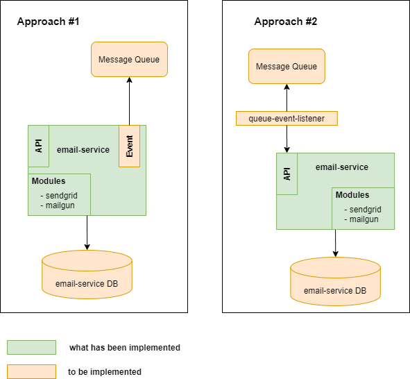

# Email Service

## Overview

This micro service is an abstraction service to email providers. Currently, it supports abstraction to SendGrid and Mailgun Service Provider.

## Proposed Final Architecture Diagram



## Environment Variables

`VERSION` app version

`PORT` app server port

`SENDGRID_SEND_URL` (module specific env variable) SendGrid send URL

`SENDGRID_API_KEY` (module specific env variable) SendGrid API KEY

`MAILGUN_SEND_URL` (module specific env variable) Mailgun send URL

`MAILGUN_API_KEY` (module specific env variable) Mailgun API KEY

## How to run: Using Docker

- Clone the project
- Create `.env` file (refer to "ENVIRONMENT VARIABLES" section above)
- type `./run.sh .env` or you can create your own environment variable

## How to run: Using npm

### Setup

- Clone the project
- Create `.env` file (refer to "ENVIRONMENT VARIABLES" section above)
- Type `npm install`

### TEST

- Type `npm test`

### Run

- Type `npm start`

## Limitations / Notes

1. This project only covers <span style="color:green">**green**</span> coloured component
2. This project is using `src/db.json` file instead of using real db document store. `priority` and `sender` configuration has not been implemented and left for suggestion (comments in code). In Production scenario, db should be coming from real database.
3. Given the current requirement, Document store DB would likely fit the purpose, but further though toward your use case might determine a better DB type selection (NoSQL or RDBMS).
4. For a production scenario, 2 usage approaches has been suggested as shown in the pictures. One is to upgrade this project to have a pub/sub mechanism which would listen from any MQ system, or option 2 to separate it as a thin layer event listener service.
5. Test script does not have 100% coverage - as this is only for demonstration purpose
6. Some work on RDBMS setup (using postgres) is available for demonstration purpose (but not used).

#### postgres setup

Define the following environment variables in your .env files (below are examples for your local setup)

```
DB_HOST=127.0.0.1
DB_PORT=5432
DB_NAME=email-service
DB_USER=postgres
DB_PASS=password
DB_SCHEMA=public
```

Type `npm run db` to create and run local postgres instance (Note: you must have docker installed on your system).
Type `npm run migrate:up` to run db migration on your DB (which was defined in your .env file)

## Service Provider Configuration

This project is using _*dynamic import*_ which will serve for convinience for future updates to email SP (service provider)'s support - allowing us to simply add SP implementation specific in the `modules` directory.

To add a new Service Provider, please follow below steps:

1. Register `[new]` service provider to the database (eg: `src/db.json`). Make sure that the status is enabled (1=enabled; 0=disabled), and configure the priority (priority 1 is the highest)
2. Add `[new]` service provider specific implementation in `src/modules/[new].ts`
